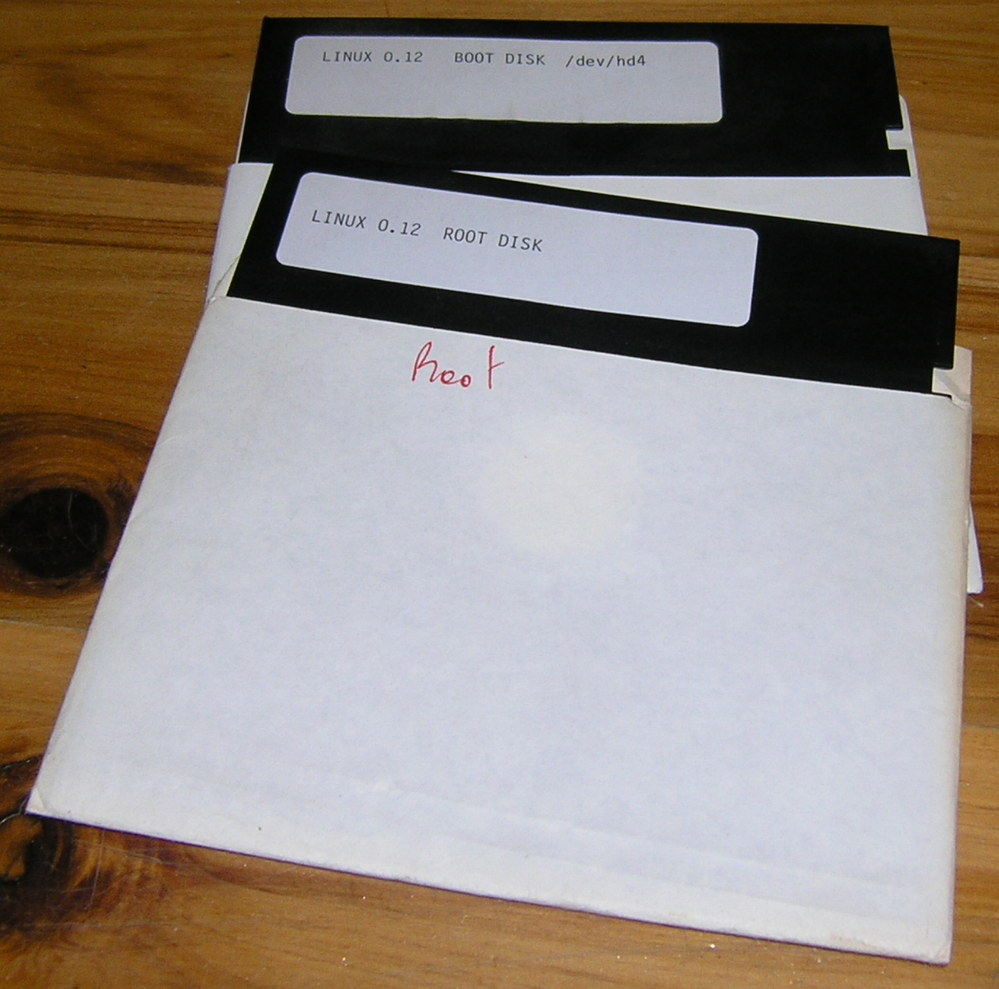
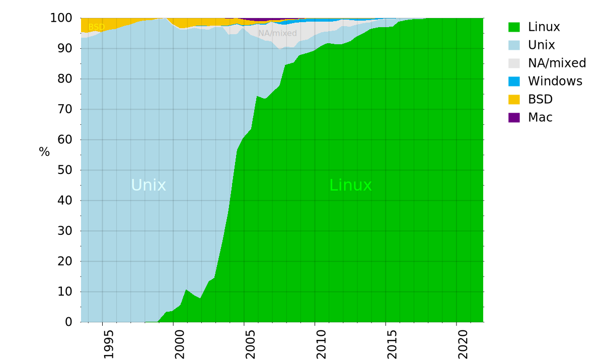
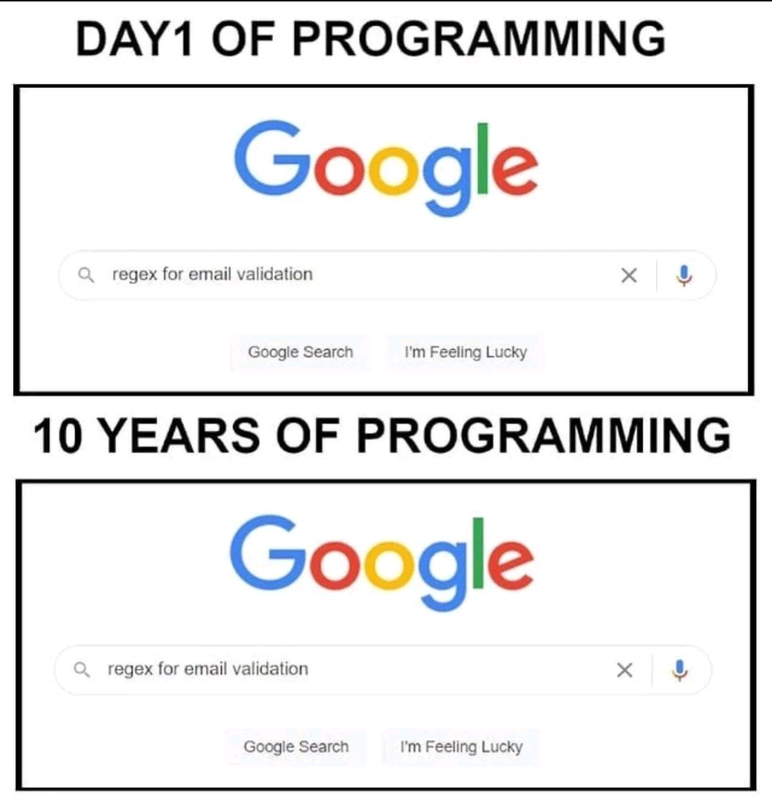
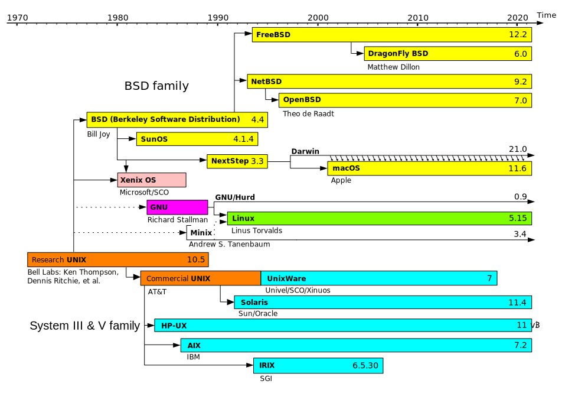

# GNU/Linux Workshop
**Executive Summary:** This document contains the materials for the UVA residential MSDS workshop on GNU/Linux. It is a compainion to the initial orientation given prior to the start of study. This workshop is part of a series designed to help students with the world larger than their own laptop. A world of high-performance computing and of cloud computing, a world dominated by GNU/Linux.

## Outline
* Introduction and Preamble
1. GNU/Linux minimum for Data Scientists
2. How to GNU/Linux

## Introduction
1. `whois` lpa2a
2. What is GNU/Linux
    * Unix = an operating system, not necessarially under open license
    * GNU = "GNU's not Unix", software suite in need of a kernel under GPL [6]
    * GPL = "GNU General Public License"
    * Linux = "Linus's Unix", a kernel under the GPL
    *  [7]
    * Put another way: GNU is the chocolate and Linux is the Peanut Butter
3. Why GNU/Linux? Simply put: it is the only relevant operating system
    *  [5]
    *  [2]
    * One exception: Playing video games, which is >95% windows
    * Yes desktop/laptops are 75% windows, but smartphones are more common (60% to 40%).
    * Put another way: `conda install numpy`
4. Goals for today
    * first half = exposure to fundamentals
    * second half = equip you to build the habit
5. GNU/Linux is a habit
    * exposure
    * practice

## Preamble
[8]

# Part I - Data Scientist GNU/Linux Minimum

## History
 [12]
## Open Software [13]
* The four freedoms (use, change, share, share changes)
* "copyleft": copyright the software and use it to ensure the freedoms
* The GPL: GNU General Public License
* Ethics question: What about software that breaks encryption? Should it be "free"?
## Exercise
1. Get bash running on your machine

## Command line interface (CLI)
1. **open** a bash terminal on rivanna -[link](https://rivanna-portal.hpc.virginia.edu/)
    * **learn** the first four terminal commands - [pwd,ls,cd,history]
    * **use** a terminal text editor - choose one [vi,nano,emacs,etc.]
    * **learn** the PATH environment variable
    * **confirm** sucessful operation by running a [hello world program](https://github.com/UVADS/orientation-technical/blob/main/lessons/lesson-hello-world.md) in BASH (or other shell if you prefer)
    * if needed your allocation = msds2023

2. GNU/Linux File Structures
* Everything is a file [9]
*  [10]

3. Text Editor

4. Exercise -- Send me an SMS or email from the command line

# Break - reconvene at ...

# Part II

## Installation Demo
* package management
* users, groups, permission
* ps and top
* ssh, scp, rsync

## Planning to build the habit

# Footnotes
[1]  TOP500 list. The benchmark we decided on was Linpack, which means that systems are ranked only by their ability to solve a set of linear equations, A x = b, using a dense random matrix A. Therefore, any supercomputer – no matter what its architecture is – can make it into the TOP500 list - topp500.org
[2] By Benedikt.Seidl - Eigenes Werk (own work) / source top500.org, Public Domain, https://commons.wikimedia.org/w/index.php?curid=5932978
[3] https://www.gartner.com/en
[4] gs.statcounter.com
[5] By Smartmo - Own work, CC BY-SA 3.0, https://commons.wikimedia.org/w/index.php?curid=22720596
[6] https://www.gnu.org/gnu/gnu-history.html
[7] By Shermozle at English Wikipedia, CC BY-SA 3.0, https://commons.wikimedia.org/w/index.php?curid=11478957
[8] The internet, author, unknown
[9] https://en.wikipedia.org/wiki/Filesystem_Hierarchy_Standard
[10] By Ppgardne - Own work, CC BY-SA 4.0, https://commons.wikimedia.org/w/index.php?curid=49654565
[11] https://en.wikipedia.org/wiki/Usage_share_of_operating_systems#:~:text=As%20of%20September%202022%2C%20Android,also%20using%20the%20Linux%20kernel.
[12] By Guillem, Wereon, Hotmocha (copied from old version&#039;s history)Christoph S. (redrew the image with Inkscape) - Original image: Image:Unix.png, Public Domain, https://commons.wikimedia.org/w/index.php?curid=1667764
[13] https://www.gnu.org/licenses/quick-guide-gplv3.html